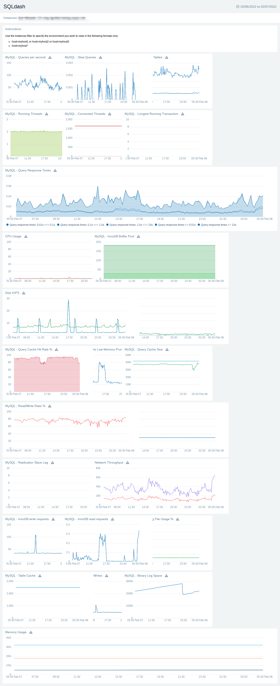

SFX To Sumo Transpiler
=========================
[SignalFlow / Splunk Observability Cloud](https://dev.splunk.com/observability/docs/signalflow/) (Functions, Methods etc.) QL to [Sumo Logic Metrics](https://help.sumologic.com/Metrics/Metric-Queries-and-Alerts/07Metrics_Operators) QL (Advanced based queries) Transpiler!

Main Features:
===============

### Visuals
- Panels' layou persistance
- Markdown panels auto-populated 
- Charts' titles and labels are translated to Sumo's Axes Aliases
- In multi-series charts, group bys are automatically mapped to sub aliases
- Color by scale mapped to the exact hexadecimal values of the native SignalFx colour palet's indexes
- Chart types translation
    - Line to Line, Area to Area
    - List of gauges to Sumo's Honeycombs
    - Queries publishing visibility translation
    - SifnalFX Rollups translated to Sumo's charts' statistics type
- Time range translation and inheritance from the dashboard

### Functional
- Collecting JSON and GDocs files directly from the GDrive
- Ability to generate output or skip a specific list of files/folders 
- Supported SignalFx streams' functions
    - Data
    - Min
- Supported SignalFx     methods (So far)
    - Aggregation: sum, max, min, count, average, mean
    - Singular: scale, percentile, above, below, bottom, top, ceil
    - Logical: filter
    - Others: rateofchange, mean_plus_stddev, fill
    - Mathematical expression translation
    - Custom labels to Sumos' standard labels
    - Referenced queries support
    - Sumo's Along operation generation
- Dashbaords' linked filters:
    -  Translated to Sumo's variables
    - In case of overrides, it will adapt to an OR condition for positive or AND otherwise
- Metrics' names lookups and translation including filtering keys
- Dev notes panels addition, stating the translation full details.

Usage
=====
The Transpiler expects the SFX Dahsboards (files or folders) to be either locally placed under ~/SFXDashboards/Local or using GDrive after setting the gdrive_folders_tobe_processed (dictionary of {"output_folder_name": "gdrive_folder_id"} pairs)

Dependencies
===============

See the contents of [requirements.txt](requirements.txt)

License
==========

Copyright 2021 Ammar Ali

Licensed under the Apache License, Version 2.0 (the "License");
you may not use this file except in compliance with the License.
You may obtain a copy of the License at

    http://www.apache.org/licenses/LICENSE-2.0

Unless required by applicable law or agreed to in writing, software
distributed under the License is distributed on an "AS IS" BASIS,
WITHOUT WARRANTIES OR CONDITIONS OF ANY KIND, either express or implied.
See the License for the specific language governing permissions and
limitations under the License.

Support
==========

This is an opensource tool that I've written in my spare time. It is NOT an official Sumo Logic product. Use at your
own risk. 

This repository and the code within are NOT supported by Sumo Logic.

Please submit bugs using the project [issues](https://github.com/SumoLogic-Labs/contents-migration-tools/issues) page. 

Sample generated dahshboard:
==============================
Below is a dashboard named as SQLDash with the following specs:

Processing Stats:
- Number of dashboards: 1
- Number of panels: 25
- Number of queries: 96
- Max number of quries of: 18 found in SQLdash / Disk IOPS
- Longest query of: 169 chars, found in SQLdash/Disk Load \#G

---

SQLDash - Imported By Sumo Transpiler
---------------------------------------

---

SQLDash - Manually Crafted
---------------------------------------

